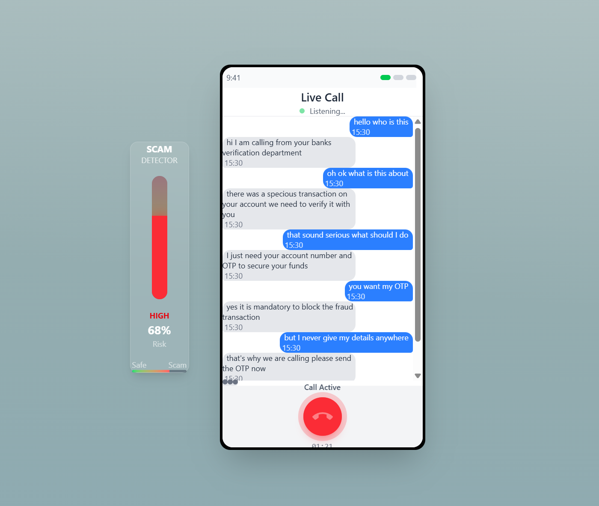

# Sevak

Our Project aims to serve as a guardian against scam calls for people and it does so by analysing conversations in real time and also providing users 
with intelligent “trap-setting” replies in parallel to “test” the scammer and boost the confidence of being a scam call.
## About

This is a college-level project made for learning and demonstration purposes. It allows users to:

- Leverages real-time interaction instead of just blocking known numbers.
- detect new, evolving scam tactics that keyword filters and number blacklists can’t.
- provides users with intelligent “trap-setting” replies.
- Scales easily as a service—browser extension, mobile app, or telco integration.
- Use a simple and modern UI with React and TailwindCSS
<br>
Currently, only local-host is supported. Working on deploying it without losing accuracy.

> You’ll need Chrome browser to get the best experience.

<br>

Here’s a preview of the dApp:  

<br>

## Tech Stack

### Frontend
- React.js
- Vite
- TailwindCSS

### Backend 
- Flask
- Flask-CORS
- Python
- Torch for deep learning
- Transformers for NLP models
- Requests for HTTP requests

## Pre-requisites
Initialize a **.env file** with hugging face token as:

```bash
HF_TOKEN = hf_xYbODZ******
```

## Backend Setup
1. Create a virtual environment:
   
   ```bash
   python -m venv venv
   source venv/bin/activate  # On Windows use `venv\Scripts\activate`
   ```
2. Install required packages:
   
   ```bash
    pip install -r requirements.txt
   ```

## Installation

```bash
npm install
```

## Local Development
1. To run the backend:
    ```bash
    python Server.py
    ```
2. To run the frontend:

    ```bash
    npm run dev
    ```

### Notes
- You need to configure .env with your Hugging Face token.
- For testing, use Chrome browser for audio processing and integration with your frontend.
